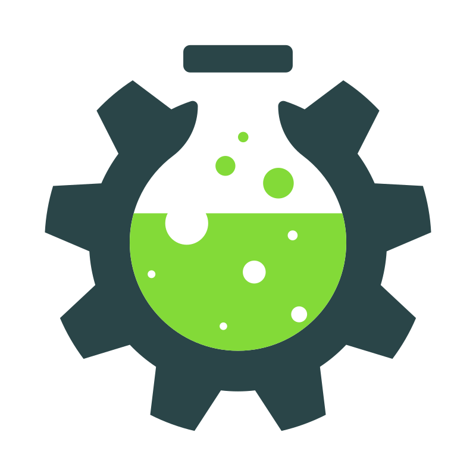

<div align="center">
  
  <h1>MyFTB Launcher</h1>
  <p>The official launcher for <a href="https://myftb.de">myftb.de</a> Minecraft modpacks.</p>

  [](https://github.com/MyFTB/launcher-v2/actions/workflows/build.yml)
  [](https://github.com/MyFTB/launcher-v2/releases/latest)
  [](LICENSE)
  [](https://discord.gg/myftb)
</div>

---

## Features

- 🗂 **Browse & install** modpacks from the MyFTB pack library
- 🚀 **One-click launch** — Forge & NeoForge handled automatically
- 🔐 **Microsoft authentication** via OAuth 2.0
- 🔄 **Auto-updates** — the launcher keeps itself up to date
- 🎮 **Discord Rich Presence** — shows what pack you're playing
- 🖥 **Cross-platform** — Windows, macOS, Linux
- ⚡ **Optional features** — pick which mods to include per pack
- 📋 **In-app console** — live log viewer with crash upload

## Installation

Download the latest installer for your platform from [Releases](https://github.com/MyFTB/launcher-v2/releases/latest):

| Platform | File |
|---|---|
| Windows | `MyFTB-Launcher-Setup-x.x.x.exe` |
| macOS (Intel) | `MyFTB-Launcher-x.x.x-x64.dmg` |
| macOS (Apple Silicon) | `MyFTB-Launcher-x.x.x-arm64.dmg` |
| Linux | `MyFTB-Launcher-x.x.x.AppImage` or `.deb` |

> **Note:** Windows and macOS builds are not currently code-signed. You may need to allow the app through your OS security prompt on first launch.

## Development

### Prerequisites

- [Node.js](https://nodejs.org/) LTS
- [Git](https://git-scm.com/)

### Setup

```bash
git clone https://github.com/MyFTB/launcher-v2.git
cd launcher-v2
npm install
```

### Commands

```bash
npm run dev          # Start the app with hot-reload
npm run build        # Production build → out/
npm run test         # Run all tests
npm run lint         # ESLint
npm run type-check   # TypeScript type checking
npm run package      # Build + create installers
```

### Project structure

```
src/
├── main/          # Electron main process (Node.js)
│   ├── ipc/       # IPC channel constants + router
│   └── services/  # Auth, install, launch, discord, update…
├── preload/       # contextBridge — typed API exposed to renderer
├── renderer/      # React UI (Vite + Tailwind CSS)
│   ├── components/
│   └── pages/
├── shared/        # Types shared across all three processes
└── tests/         # Vitest unit tests (pure logic)
```

## Contributing

Contributions are welcome! Please read [CONTRIBUTING.md](CONTRIBUTING.md) before opening a pull request.

## License

This project is licensed under the **GNU General Public License v3.0** — see [LICENSE](LICENSE) for details.
